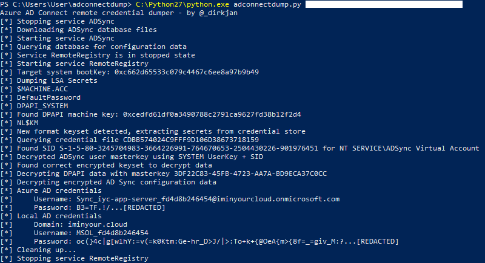

# Azure AD Connect password extraction
[](https://dev.azure.com/dirkjanm/adconnectdump/_build/latest?definitionId=16&branchName=master)
This toolkit offers several ways to extract and decrypt stored Azure AD and Active Directory credentials from Azure AD Connect servers. These credentials have high privileges in both the on-premise directory and the cloud. The tools are released as part of my Azure AD presentation at TROOPERS 19. For more info on the technical background you can watch the presentation on [YouTube](https://www.youtube.com/watch?v=JEIR5oGCwdg) or view the slides [here](https://www.slideshare.net/DirkjanMollema/im-in-your-cloud-reading-everyones-email-hacking-azure-ad-via-active-directory).  You can download the latest binaries of this tool [here](https://dev.azure.com/dirkjanm/adconnectdump/_build/latest?definitionId=16&branchName=master) (click on Artifacts in the top right corner).

# Tool comparison
This repository features 3 different ways of dumping credentials. 
- **ADSyncDecrypt**: Decrypts the credentials fully on the target host. Requires the AD Connect DLLs to be in the PATH. A similar version in PowerShell was released by Adam Chester [on his blog](https://blog.xpnsec.com/azuread-connect-for-redteam/).
- **ADSyncGather**: Queries the credentials and the encryption keys on the target host, decryption is done locally (python). No DLL dependencies.
- **ADSyncQuery**: Queries the credentials from the database that is saved locally. Requires MSSQL LocalDB to be installed. No DLL dependencies. Is called from `adconnectdump.py`, dumps data without executing anything on the Azure AD connect host.

The following table highlights the differences between the techniques:

Tool | Requires code execution on target | DLL dependencies | Requires MSSQL locally | Requires python locally
--- | --- | --- | --- | ---
ADSyncDecrypt | Yes | Yes | No | No
ADSyncGather | Yes | No | No | Yes
ADSyncQuery | No (network RPC calls only) | No | Yes | Yes

# Usage
## ADSyncDecrypt
Execute as admin on the Azure AD connect host from a location that has the required DLLs (by default AD Connect is installed in `C:\Program Files\Microsoft Azure AD Sync\Bin`). It will give you the configuration XML and the decrypted encrypted configuration.

## ADSyncGather
Run ADSyncGather.exe on the Azure AD connect host (as Administrator), for example in memory using `execute-assembly`. Save the output to a file and parse it with `decrypt.py`:
```
F:\> decrypt.py .\output.txt utf-16-le
Azure AD credentials
        Username: Sync_o365-app-server_206b1a1ede1f@frozenliquids.onmicrosoft.com
        Password: :&A!>rWD...[REDACTED]
Local AD credentials
        Domain: office.local
        Username: MSOL_206b1a1ede1f
        Password: )JH|L;hO2UUVIE*T>k[6R2.S!l%Wdxmf(@w_tYlEA:5{G)Ka[sT|E0E[9>m!(N=...[REDACTED]
```

## ADSyncQuery / adconnectdump.py
You should call `adconnectdump.py` from Windows. It will dump the Azure AD connect credentials over the network similar to secretsdump.py (you also will need to have [impacket](https://github.com/SecureAuthCorp/impacket) and `pycryptodomex` installed to run this). ADSyncQuery.exe should be in the same directory as it will be used to parse the database that is downloaded (this requires MSSQL LocalDB installed on your host).


